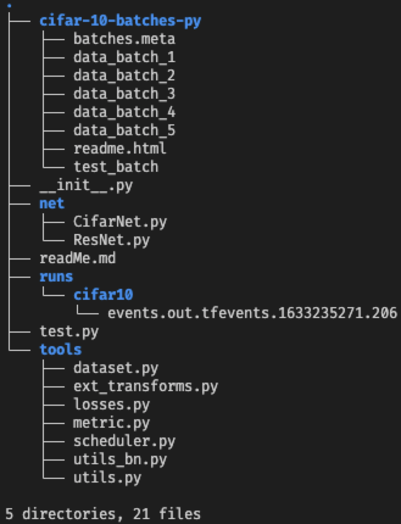

# Lseeon 2 TASK: A Classification network on Cifar10

目录
=================

   * [Introduction](#introduction)
   * [Installation](#installation)
   * [Running Single-Image Tasks](#running-single-image-tasks)
        * [Storing Representations](#storing-representations)
        * [Storing Predictions](#storing-predictions)
   * [Running Multi-Image Tasks](#running-multi-image-tasks)
   * [Training Data Statistics](#training-data-statistics)
   * [Citing](#citing)


<div align="center">
  
</div>

---

## **整体介绍**
1. 此仓库存放了人工智能安全课程第二次课程作业，搭建分类神经网络在Cifar10公开数据集上完成分类任务

2. 本次作业最终在Cifar10测试集上取得了94.3%的top-1分类准确度

---

## **文件结构**
<div align="center">
  
</div>

---
## **网络结构**

1. 本次作业的整体网络由 主干特征提取网络 + 特征分类网络 组成

2. 主干提取网络采用ResNet50, 并修改最后的全局池化层, 将全局池化为 1 像素, 改为全局池化为 4 像素, 保留了更多的图像特征

3. 特征分类网络采用线性层, 完成特征分类映射

---
## **训练细节**
1. 训练框架: pytorch

1. 优化器: SGD

2. 学习率: 0.1

3. 权重衰减: 5e-4

4. BatchSize: 128

5. 训练轮数: 200 epoch

6. 学习率更新方式: WarmUp + Poly

7. 数据增强方式: RandomCrop、RandomHorizontalFlip、RandomRotation 

8. 数据记录: 实验数据采用tensorboard记录并绘制相关曲线图

---
## **开始训练**
```
python test.py

tensorboard --logdir runs
```

---
## **实验过程**


### 学习率的选取

### 学习率更新策略的选取

### 抑制过拟合(权重衰减的选取)

---
## **网络最终实验结果**

|Acc                                    |F1                                |
|:------------------------------------:|------------------------------------|
|MarkDown                              |[](https://github.com/younghz/Markdown "Markdown")|


---
## Citing

If you find the code or the models useful, please cite this paper:
```
@article{DBLP:journals/corr/HeZRS15,
  author    = {Kaiming He and
               Xiangyu Zhang and
               Shaoqing Ren and
               Jian Sun},
  title     = {Deep Residual Learning for Image Recognition},
  journal   = {CoRR},
  volume    = {abs/1512.03385},
  year      = {2015},
  url       = {http://arxiv.org/abs/1512.03385},
  eprinttype = {arXiv},
  eprint    = {1512.03385},
  timestamp = {Wed, 17 Apr 2019 17:23:45 +0200},
  biburl    = {https://dblp.org/rec/journals/corr/HeZRS15.bib},
  bibsource = {dblp computer science bibliography, https://dblp.org}
}
```

### License

The code and models are released under the MIT License (refer to the [LICENSE](https://github.com/StanfordVL/taskonomy/blob/master/LICENSE) file for details).
 
